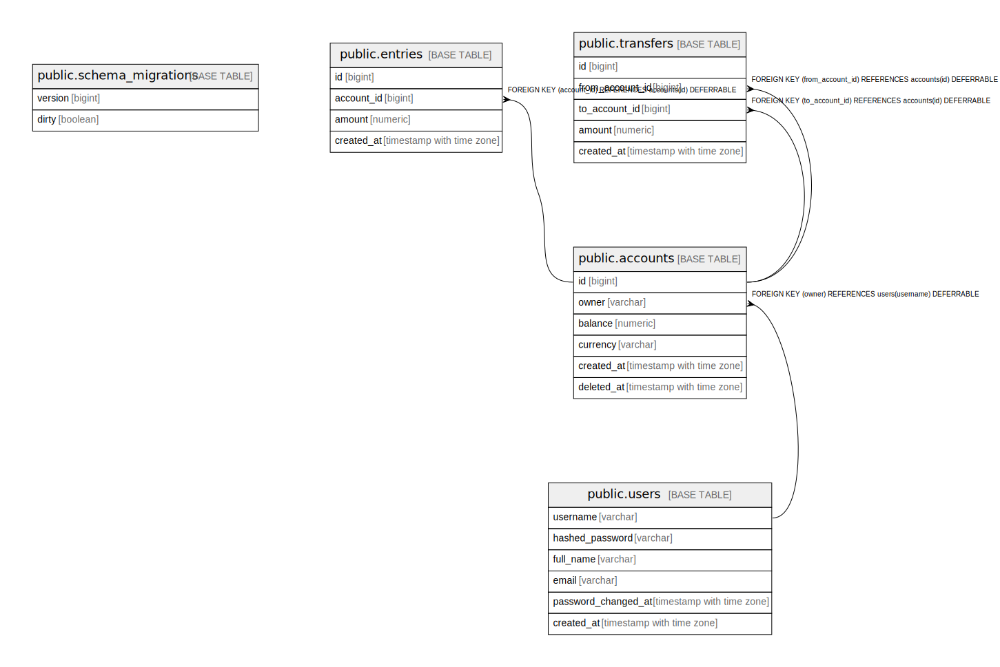

# gobank

## Tables

| Name | Columns | Comment | Type |
| ---- | ------- | ------- | ---- |
| [public.schema_migrations](public.schema_migrations.md) | 2 |  | BASE TABLE |
| [public.accounts](public.accounts.md) | 6 |  | BASE TABLE |
| [public.entries](public.entries.md) | 4 |  | BASE TABLE |
| [public.transfers](public.transfers.md) | 5 |  | BASE TABLE |
| [public.users](public.users.md) | 6 |  | BASE TABLE |

## Relations

---

> Generated by [tbls](https://github.com/k1LoW/tbls)
