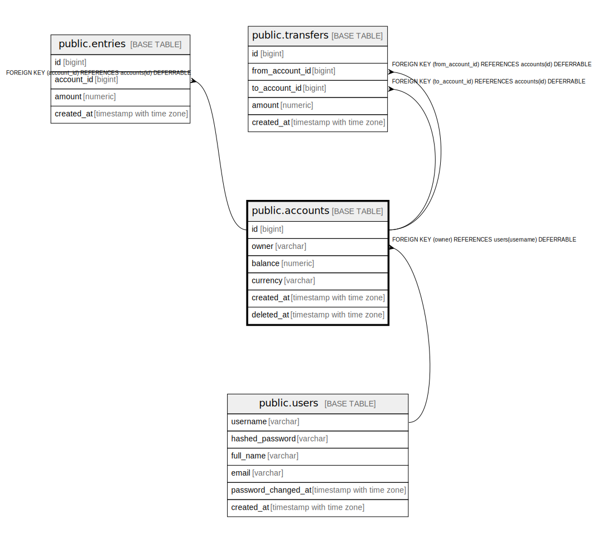

# public.accounts

## Columns

| Name | Type | Default | Nullable | Children | Parents | Comment |
| ---- | ---- | ------- | -------- | -------- | ------- | ------- |
| id | bigint | nextval('accounts_id_seq'::regclass) | false | [public.entries](public.entries.md) [public.transfers](public.transfers.md) |  |  |
| owner | varchar |  | false |  | [public.users](public.users.md) |  |
| balance | numeric |  | false |  |  |  |
| currency | varchar |  | false |  |  |  |
| created_at | timestamp with time zone | now() | false |  |  |  |
| deleted_at | timestamp with time zone |  | true |  |  |  |

## Constraints

| Name | Type | Definition |
| ---- | ---- | ---------- |
| accounts_balance_not_null | n | NOT NULL balance |
| accounts_created_at_not_null | n | NOT NULL created_at |
| accounts_currency_not_null | n | NOT NULL currency |
| accounts_id_not_null | n | NOT NULL id |
| accounts_owner_not_null | n | NOT NULL owner |
| accounts_pkey | PRIMARY KEY | PRIMARY KEY (id) |
| accounts_owner_fkey | FOREIGN KEY | FOREIGN KEY (owner) REFERENCES users(username) DEFERRABLE |

## Indexes

| Name | Definition |
| ---- | ---------- |
| accounts_pkey | CREATE UNIQUE INDEX accounts_pkey ON public.accounts USING btree (id) |
| accounts_owner_idx | CREATE INDEX accounts_owner_idx ON public.accounts USING btree (owner) |
| accounts_owner_currency_idx | CREATE UNIQUE INDEX accounts_owner_currency_idx ON public.accounts USING btree (owner, currency) WHERE (deleted_at IS NULL) |
| accounts_deleted_at_idx | CREATE INDEX accounts_deleted_at_idx ON public.accounts USING btree (deleted_at) WHERE (deleted_at IS NULL) |

## Relations

---

> Generated by [tbls](https://github.com/k1LoW/tbls)
