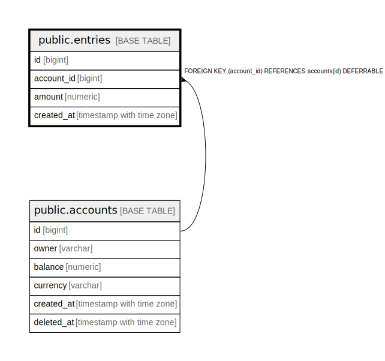

# public.entries

## Columns

| Name | Type | Default | Nullable | Children | Parents | Comment |
| ---- | ---- | ------- | -------- | -------- | ------- | ------- |
| id | bigint | nextval('entries_id_seq'::regclass) | false |  |  |  |
| account_id | bigint |  | false |  | [public.accounts](public.accounts.md) |  |
| amount | numeric |  | false |  |  | can be negative or positive |
| created_at | timestamp with time zone | now() | false |  |  |  |

## Constraints

| Name | Type | Definition |
| ---- | ---- | ---------- |
| entries_account_id_not_null | n | NOT NULL account_id |
| entries_amount_not_null | n | NOT NULL amount |
| entries_created_at_not_null | n | NOT NULL created_at |
| entries_id_not_null | n | NOT NULL id |
| entries_account_id_fkey | FOREIGN KEY | FOREIGN KEY (account_id) REFERENCES accounts(id) DEFERRABLE |
| entries_pkey | PRIMARY KEY | PRIMARY KEY (id) |

## Indexes

| Name | Definition |
| ---- | ---------- |
| entries_pkey | CREATE UNIQUE INDEX entries_pkey ON public.entries USING btree (id) |
| entries_account_id_idx | CREATE INDEX entries_account_id_idx ON public.entries USING btree (account_id) |

## Relations

---

> Generated by [tbls](https://github.com/k1LoW/tbls)
