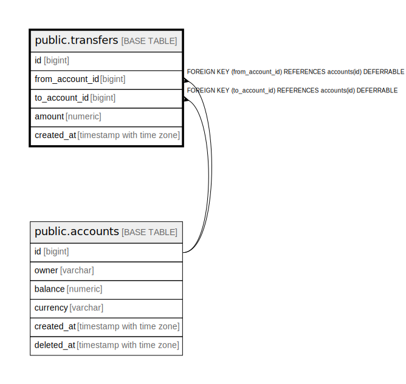

# public.transfers

## Columns

| Name | Type | Default | Nullable | Children | Parents | Comment |
| ---- | ---- | ------- | -------- | -------- | ------- | ------- |
| id | bigint | nextval('transfers_id_seq'::regclass) | false |  |  |  |
| from_account_id | bigint |  | false |  | [public.accounts](public.accounts.md) |  |
| to_account_id | bigint |  | false |  | [public.accounts](public.accounts.md) |  |
| amount | numeric |  | false |  |  | must be positive |
| created_at | timestamp with time zone | now() | false |  |  |  |

## Constraints

| Name | Type | Definition |
| ---- | ---- | ---------- |
| transfers_amount_not_null | n | NOT NULL amount |
| transfers_created_at_not_null | n | NOT NULL created_at |
| transfers_from_account_id_not_null | n | NOT NULL from_account_id |
| transfers_id_not_null | n | NOT NULL id |
| transfers_to_account_id_not_null | n | NOT NULL to_account_id |
| transfers_from_account_id_fkey | FOREIGN KEY | FOREIGN KEY (from_account_id) REFERENCES accounts(id) DEFERRABLE |
| transfers_to_account_id_fkey | FOREIGN KEY | FOREIGN KEY (to_account_id) REFERENCES accounts(id) DEFERRABLE |
| transfers_pkey | PRIMARY KEY | PRIMARY KEY (id) |

## Indexes

| Name | Definition |
| ---- | ---------- |
| transfers_pkey | CREATE UNIQUE INDEX transfers_pkey ON public.transfers USING btree (id) |
| transfers_from_account_id_idx | CREATE INDEX transfers_from_account_id_idx ON public.transfers USING btree (from_account_id) |
| transfers_to_account_id_idx | CREATE INDEX transfers_to_account_id_idx ON public.transfers USING btree (to_account_id) |
| transfers_from_account_id_to_account_id_idx | CREATE INDEX transfers_from_account_id_to_account_id_idx ON public.transfers USING btree (from_account_id, to_account_id) |

## Relations

---

> Generated by [tbls](https://github.com/k1LoW/tbls)
