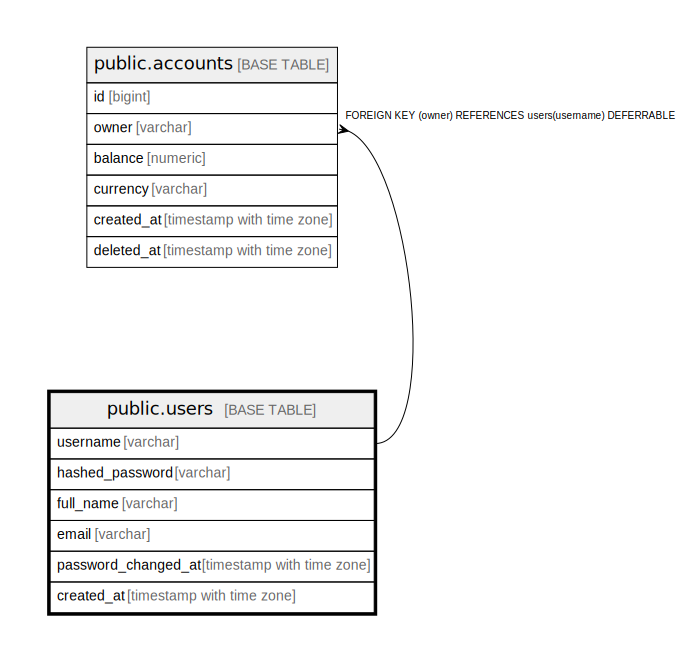

# public.users

## Columns

| Name | Type | Default | Nullable | Children | Parents | Comment |
| ---- | ---- | ------- | -------- | -------- | ------- | ------- |
| username | varchar |  | false | [public.accounts](public.accounts.md) |  |  |
| hashed_password | varchar |  | false |  |  |  |
| full_name | varchar |  | false |  |  |  |
| email | varchar |  | false |  |  |  |
| password_changed_at | timestamp with time zone | '0001-01-01 00:00:00+00'::timestamp with time zone | false |  |  |  |
| created_at | timestamp with time zone | now() | false |  |  |  |

## Constraints

| Name | Type | Definition |
| ---- | ---- | ---------- |
| users_created_at_not_null | n | NOT NULL created_at |
| users_email_not_null | n | NOT NULL email |
| users_full_name_not_null | n | NOT NULL full_name |
| users_hashed_password_not_null | n | NOT NULL hashed_password |
| users_password_changed_at_not_null | n | NOT NULL password_changed_at |
| users_username_not_null | n | NOT NULL username |
| users_pkey | PRIMARY KEY | PRIMARY KEY (username) |
| users_email_key | UNIQUE | UNIQUE (email) |

## Indexes

| Name | Definition |
| ---- | ---------- |
| users_pkey | CREATE UNIQUE INDEX users_pkey ON public.users USING btree (username) |
| users_email_key | CREATE UNIQUE INDEX users_email_key ON public.users USING btree (email) |

## Relations

---

> Generated by [tbls](https://github.com/k1LoW/tbls)
